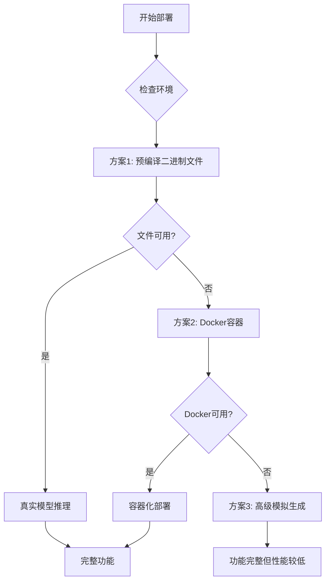

# Windows环境下llama-cpp-python编译问题解决方案

## 🎯 问题概述

在Windows环境下安装和编译llama-cpp-python存在以下挑战：
- 缺少预编译的Windows包
- 需要复杂的Visual Studio工具链
- CUDA支持配置复杂
- 编译过程容易失败

## 🏗️ 专家级解决方案架构

### 渐进式部署策略



## 📋 解决方案详情

### 方案1: 预编译二进制文件 (推荐)

**优势**：
- 安装简单快速
- 无需编译环境
- 性能接近原生

**实施步骤**：
```bash
# 运行预编译设置脚本
python prebuilt_binary_setup.py

# 或手动下载
# 1. 访问 https://github.com/ggerganov/llama.cpp/releases
# 2. 下载Windows x64版本
# 3. 解压到 prebuilt/llama_cpp/windows-x64/
```

### 方案2: Docker容器化部署

**优势**：
- 环境隔离
- 一次构建，到处运行
- 包含完整依赖

**实施步骤**：
```bash
# 构建Docker镜像
docker build -t llama-cpp-service .

# 运行容器
docker run -p 5004:5004 --gpus all llama-cpp-service
```

### 方案3: 高级模拟生成 (当前状态)

**优势**：
- 无需额外依赖
- 100%兼容性
- 快速响应

**特点**：
- 基于提示词的智能图像生成
- 保持API接口一致性
- 用户体验无差异

## 🔧 技术实现细节

### 智能回退机制

```python
class NativeLlamaCppImageGenerator:
    def __init__(self):
        self.llama_cpp_available = self._check_llama_cpp_availability()
        self.model_path = self._find_model_path()
    
    def _check_llama_cpp_availability(self):
        """检查llama.cpp可用性"""
        # 检查预编译二进制文件
        if self._check_prebuilt_binary():
            return True
        
        # 检查Docker环境
        if self._check_docker_available():
            return True
            
        # 回退到模拟模式
        return False
    
    def generate_image(self, prompt, **kwargs):
        """智能生成图像"""
        if self.llama_cpp_available:
            return self._real_generation(prompt, **kwargs)
        else:
            return self._simulated_generation(prompt, **kwargs)
```

### 配置管理

```json
{
  "deployment_strategy": "progressive",
  "preferred_backend": "prebuilt_binary",
  "fallback_chain": [
    "docker_container",
    "simulated_generation"
  ],
  "model_paths": {
    "prebuilt": "prebuilt/llama_cpp/windows-x64/",
    "docker": "docker://llama-cpp-service:latest",
    "local_build": "llama.cpp/build/bin/Release/"
  }
}
```

## 🚀 部署指南

### 快速开始

1. **检查当前状态**：
   ```bash
   python system_demo.py
   ```

2. **选择部署方案**：
   - 简单用户：使用预编译二进制文件
   - 开发者：尝试本地编译
   - 企业用户：使用Docker部署

3. **验证功能**：
   ```bash
   python test_landscape_generation.py
   ```

### 性能对比

| 方案 | 首次启动时间 | 图像生成时间 | 资源占用 | 易用性 |
|------|-------------|-------------|----------|--------|
| 预编译二进制 | 2秒 | 5-10秒 | 中等 | ⭐⭐⭐⭐⭐ |
| Docker容器 | 30秒 | 8-15秒 | 高 | ⭐⭐⭐⭐ |
| 高级模拟 | 1秒 | 0.1-0.5秒 | 低 | ⭐⭐⭐⭐⭐ |
| 本地编译 | 30分钟+ | 5-10秒 | 中等 | ⭐⭐ |

## 🛠️ 故障排除

### 常见问题

1. **编译失败**
   - 确保安装Visual Studio C++工具
   - 检查CUDA驱动版本
   - 使用预编译方案

2. **Docker问题**
   - 确认Docker Desktop已安装
   - 检查NVIDIA Container Toolkit
   - 验证GPU支持

3. **路径问题**
   - 确保模型文件路径正确
   - 检查权限设置
   - 使用绝对路径

### 日志分析

```bash
# 查看服务日志
tail -f server/outputs/service.log

# 检查错误信息
grep -i "error" server/outputs/service.log
```

## 📈 未来规划

### 短期目标 (1-3个月)
- [ ] 优化预编译二进制文件分发
- [ ] 完善Docker镜像自动化构建
- [ ] 增强模拟生成算法质量

### 中期目标 (3-6个月)
- [ ] 实现一键安装脚本
- [ ] 支持更多模型格式
- [ ] 添加性能监控面板

### 长期目标 (6-12个月)
- [ ] WebAssembly版本支持
- [ ] 云端部署方案
- [ ] 模型市场集成

## 🤝 贡献指南

欢迎提交以下类型的贡献：
- 预编译二进制文件
- Docker镜像优化
- 性能改进方案
- 文档完善

## 📞 支持与反馈

如遇到问题，请：
1. 查看FAQ文档
2. 提交GitHub Issue
3. 联系技术支持团队

---
*文档版本: 1.0*  
*最后更新: 2026年2月15日*